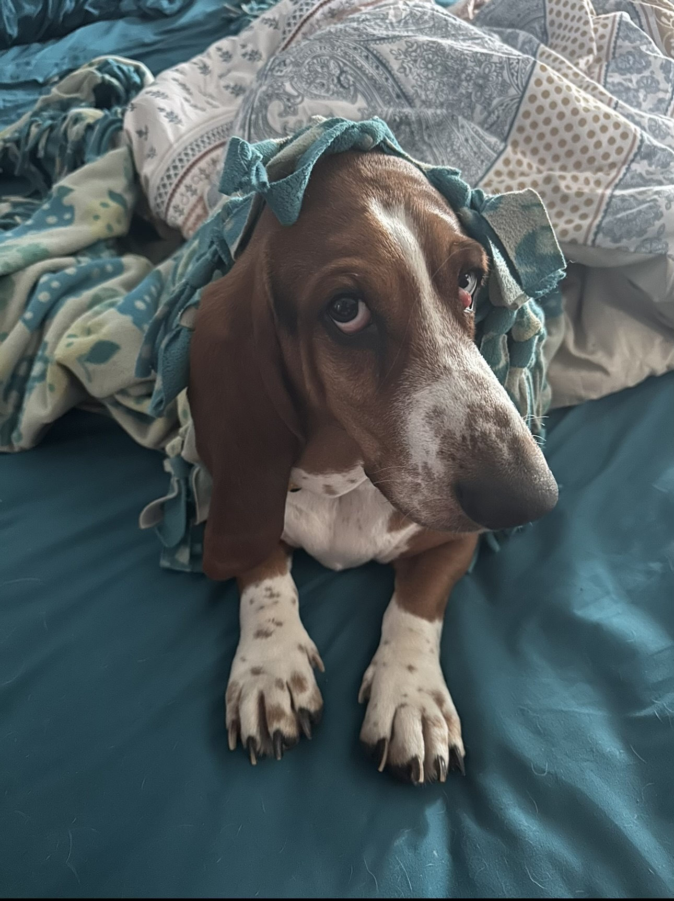

# My First Coding Assignment

## About Me

My wife and I have a few rescue dogs that we enjoy spoiling and hanging out with. We both wanted a basset hound since we were kids so we finally decided to get one. In my spare time I really enjoy being outside and working in the garden.

## Past Coding Experience

My past coding experience really has always been a form of trial by fire and studying topics from Coursera or FreeCodeCamp or needing to complete something for work in 15 minutes that I haven't done in the past. In my usual day at work I handle a decent amount of web projects, but they are mainly front-end edits or SEO related.

## Career Goals

1. Take my career and current position from mainly front-end/seo into a more developer role.
2. Earn my Master's degree to help cement my position.
3. I believe I would enjoy teaching one day, and hope to get to try it out.
